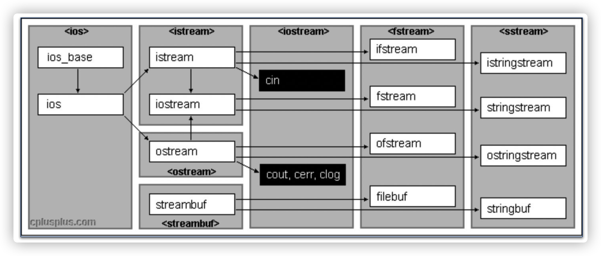
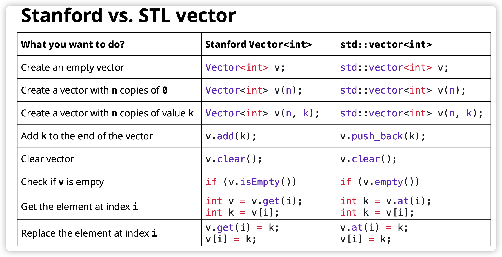
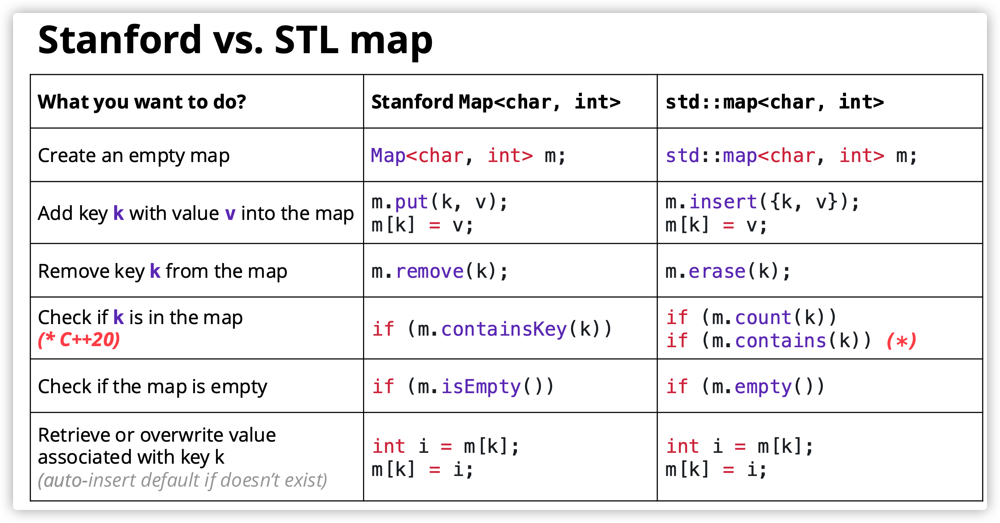
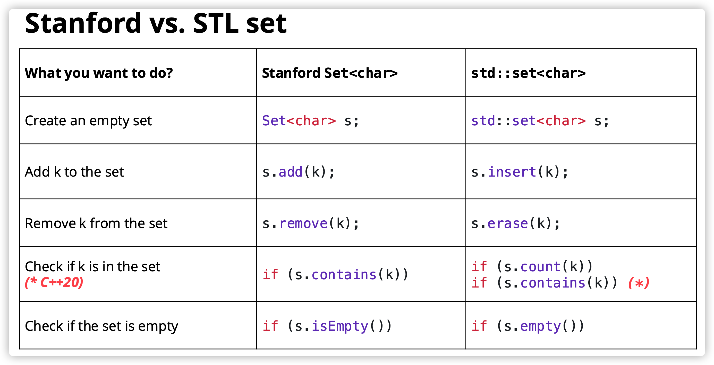
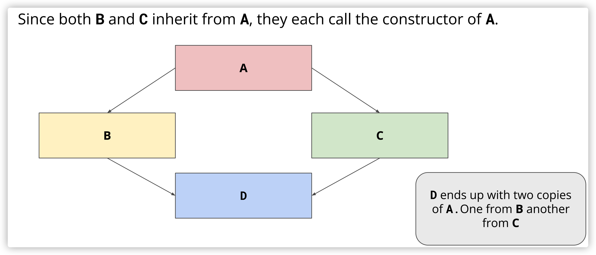
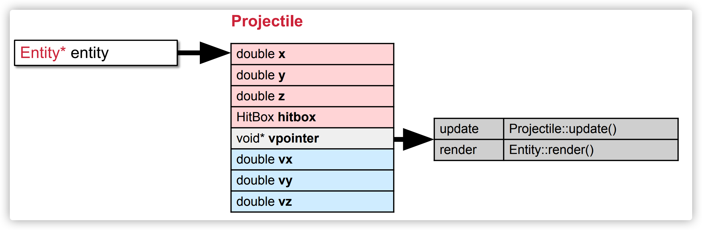

## Timeline

- 2026.01.08 lecture1
- 2026.01.10 lecture2
- 2026.01.11 lecture3, 4, 5, 6  assignment 0
- 2026.01.12 lecture7, 8 assignment1, 2
- 2026.01.13 lecture9, 10 assignment3
- 2026.01.14 lecture11, 12 
- 2026.01.16 lecture13
- 2026.01.17 lecture14, assignment4
- 2026.01.19 lecture15, 
- 2026.01.21 lecture16, optional lec
- 2026.01.23 assignment5 

## 重点知识总结


## Notes

### day1

C++ is “**The invisible foundation of everything**”

- Game
- High Frequency Trading
- Self Driving
- GPU Programming
- Database
- Web Browser
- VR
- Low level ML
- Compiler/OS

C++在下面这些方面做得好：

- Handling lots of data（处理大量数据）
- And handling it very efficiently（高效）
- And doing it in an elegant, readable way（优雅）

C++帮助养成更好的开发习惯：

- 我是否使用了合适的方式使用对象？
  - 类型检查、类型安全
- 我是否高效使用了内存？
  - 引用语义、拷贝语义、移动语义
- 我是否修改了不应该修改的内容？

在很多其它语言中则放宽了这些条件。

之后很多课程会用到C++：

- CS110：https://web.stanford.edu/~ouster/cs111-spring24/
- CME213：https://ericdarve.github.io/cme213-spring-2021/

- CS143：https://web.stanford.edu/class/cs143/
- CS144：https://cs144.github.io/

### day2

解释和编译

- 解释：对代码按行解释并执行
- 编译：将源代码翻译为可执行文件，然后执行

运行时错误和编译时错误

- Python这类语言只有在运行时遇到错误才能知道代码是否存在错误
- 而C/C++能够在编译时就检查出大量错误

Types

- Type表示一个变量的类别
- C++是一个编译的、静态类型的语言，而Python则是一个动态类型的语言
- 静态类型指变量只能被定义为一种类型，在运行时不能随意变换类型

- 为什么要静态类型？更高效、更容易理解和推理、更容易检查出错误

> 归根到底，C++所做的一切就是让问题尽可能在编译时暴漏出来，避免在运行时才发现问题，导致更大的损失。

测试：

```c++
string a = "test";
double b = 3.2 * 5 - 1;
int c = 5 / 2;
int d(int foo) { return foo / 2; }
double e(double foo) { return foo / 2; }
int f(double foo) { return (int)(foo + 0.5); }
void g(double c) { std::cout << c << std::endl; }
```

函数重载：

- 可以定义同名函数，但是需要保证参数列表不同
- 函数重载是一种编译时多态，由编译器实现

结构体：

- 结构体的定义和使用

```c++
struct StanfordID {
  string name; // These are called fields
  string sunet; // Each has a name and type
  int idNumber;
};

StanfordID id; // Initialize struct
id.name = "THE Stanford Tree"; // Access field with ‘.’
id.sunet = "theTREE";
id.idNumber = 0000002;
```

- 初始化结构体的方式：

```c++
// Order depends on field order in struct. ‘=‘ is optional
StanfordID tree = { "THE Stanford Tree", "theTREE", 0000002 };
StanfordID lelandjr { ”Leland Stanford Jr", ”thejunior", 5430282 };
```

`std::pair`

```c++
template <typename T1, typename T2>
struct pair {
  T1 first;
  T2 second;
};

std::pair<std::string, int> dozen { "Eggs", 12 };
std::string item = dozen.first; // "Eggs"
int quantity = dozen.second; // 12
```

- `std::pair`是一个类模版，用来对两个任意类型元素进行复合

- 它被包含在头文件`<utility>`中

```c++
#include <iostream>
#include <utility>
#include <format>
#include <cmath>

using Zeros = std::pair<double, double>;
using Solution = std::pair<bool, Zeros>;

Solution
solveQuadratic(double a, double b, double c)
{
	Solution result = { false, {0.0, 0.0} };
	double delta = b * b - 4 * a * c;
	if (delta < 0) {
		return result;
	}

	result.first = true;
	result.second.first = (-b - sqrt(delta)) / (2 * a);
	result.second.second = (-b + sqrt(delta)) / (2 * a);

	return result;
}

int
main()
{
	double a, b, c;
	std::cout << "Enter a b c: ";
	std::cin >> a >> b >> c;

	auto ans = solveQuadratic(a, b, c);

	if (ans.first) {
		auto first = ans.second.first;
		auto second = ans.second.second;
		if (first == second) {
			std::cout << std::format("There is one solution: {}\n", first);
		} else {
			std::cout << std::format("There are two different solutions: {} and {}\n", first, second);
		}
	} else {
		std::cout << std::format("There is no solution for {}x^2 + {}x + {}", a, b, c)
			<< std::endl;
	}
}
```

- 使用using来为类型起别名，简化思考和代码编写
- 使用auto来避免编写冗长的类型
- 使用format（C++20）来对cout进行格式化输出

### day3

初始化：在构建时给定初值

- 直接初始化：如果初始值和变量类型不同，会直接强行转换
- 统一初始化：
  - 遇到窄化的类型转换，在编译时会报错
  - 非常常见，可用于vector、map、自定义类型
- 结构绑定（C++17）
  - 用于对**编译时长度确定**的数据结构来解包
  - 配合auto关键字可以快速实现解包任务

```c++
//直接初始化
int a = 10.2;
int b(10.2);

// 统一初始化
int c{10.2};
std::map<std::string, int> ages{
  {"Alice", 25},
  {"Bob", 30},
  {"Charlie", 35}
};
std::vector<int> numbers{1, 2, 3, 4, 5};


// 结构初始化
std::tuple<std::string, std::string, std::string> getClassInfo() {
  std::string className = "CS106L";
  std::string buildingName = ”Thornton 110";
  std::string language = "C++";
  return {className, buildingName, language};
}

int main() {
  auto [className, buildingName, language] = getClassInfo();
  std::cout << "Come to " << buildingName << " and join us for " << className
    << " to learn " << language << "!" << std::endl;
  return 0;
}
```

tuple：https://en.cppreference.com/w/cpp/utility/tuple.html

- 一个类模版，模版参数为其所有元素的类型

- 使用uniform初始化快速构建tuple
- `get`（`std::get<0>(x)`）是一个函数模版，模版参数为tuple元素的下标，参数为tuple，用于获取tuple对应下标的元素
- 可以使用`tie`函数来对tuple解包（unpack），类似python
- C++17后可以使用**结构绑定**来实现解包

```c++
#include <iostream>
#include <stdexcept>
#include <string>
#include <tuple>
 
std::tuple<double, char, std::string> get_student(int id)
{
    switch (id)
    {
        case 0: return {3.8, 'A', "Lisa Simpson"};
        case 1: return {2.9, 'C', "Milhouse Van Houten"};
        case 2: return {1.7, 'D', "Ralph Wiggum"};
        case 3: return {0.6, 'F', "Bart Simpson"};
    }
 
    throw std::invalid_argument("id");
}
 
int main()
{
    const auto student0 = get_student(0);
    std::cout << "ID: 0, "
              << "GPA: " << std::get<0>(student0) << ", "
              << "grade: " << std::get<1>(student0) << ", "
              << "name: " << std::get<2>(student0) << '\n';
 
    const auto student1 = get_student(1);
    std::cout << "ID: 1, "
              << "GPA: " << std::get<double>(student1) << ", "
              << "grade: " << std::get<char>(student1) << ", "
              << "name: " << std::get<std::string>(student1) << '\n';
 
    double gpa2;
    char grade2;
    std::string name2;
    std::tie(gpa2, grade2, name2) = get_student(2);
    std::cout << "ID: 2, "
              << "GPA: " << gpa2 << ", "
              << "grade: " << grade2 << ", "
              << "name: " << name2 << '\n';
 
    // C++17 structured binding:
    const auto [gpa3, grade3, name3] = get_student(3);
    std::cout << "ID: 3, "
              << "GPA: " << gpa3 << ", "
              << "grade: " << grade3 << ", "
              << "name: " << name3 << '\n';
}
```

reference：

- reference是为已存在事物起一个别名
- reference一般用于函数的参数传递，避免参数值传递带来的拷贝开销
- reference的本质就是传指针（地址），类似一个语法糖

左值和右值：

- 左指
  - Locator value
  - 既可以在赋值符号左侧，也可以在赋值符号右侧
  - 拥有内存地址
- 右值
  - Read value
  - 只能在赋值符号右侧
  - 临时值，没有内存地址

左值的引用不能接收右值：

```c++
void func(int& num) {
  ...
}

int main() {
  func(1);   // error
}
```

const：

- 使用const修饰的对象在初始化后不能再修改
- 在编译时就会检查是否存在修改常量的问题

Streams



> 为一个编程语言设计和实现一个通用的I/O抽象是非常困难的。

Stream这个抽象提供流一个一致的接口，能够进行数据的读/写。

> Streams allow for a universal way of dealing with external data

- ios_base是一切stream的基类
  - 包含了状态信息、控制信息
- basic_ios保证了stream能够正确工作，以及确定stream来自哪里
- ostream和istream 分别用于输出/输入
  - ostream包括：std::ofstream、std::ostringstring和std::cout
  - istream包括：std::ifstream、std::istringstring和std::cin
- 区分一下 `std::iostream`、`std::fstream`和`std::stringstream`
  - `std::iostream` 输入/输出的对象是标准输入/输出（终端和键盘）
  - `std::fstream` 输入/输出的对象是文件（<< 表示写文件，>> 表示读文件）
  - `std::stringstream` 输入/输出的对象是String（<< 表示写内容到String，>> 表示从String中读）


stringstream的示例：

```c++
#include <iostream>
#include <sstream>

int
main(void)
{
	std::string initial_quote = "Bjarne Stroustrup C makes it easy to shoot yourself in the foot\n";
	std::stringstream ss(initial_quote);

	std::string first;
	std::string last;
	std::string language, extracted_quote;

	ss >> first >> last >> language;
	std::getline(ss, extracted_quote);
	std::cout << first << " " << last << " said this: '" << language << " "  << extracted_quote + "'" << std::endl;

	return 0;
}
```

结果：

```shell
~/minghan/courses/CS106L/lec_code % clang++ stringstream.cpp
~/minghan/courses/CS106L/lec_code % ./a.out
Bjarne Stroustrup said this: 'C  makes it easy to shoot yourself in the foot'
```

C++的iostream是带缓冲的I/O，因此只有以下情况才会flush缓冲区：

- 调用`std::flush`
- 调用`std::endl`（先输出换行符，然后flush）
- 程序全部执行完毕
- buffer满了
- 在有新的输入进入之前，先将缓冲区内容flush

cerr和clog

- cerr用于输出error（无缓冲）
- clog用于非关键事件的日志记录（有缓冲）

默认情况下，**C++ 的标准流**（`cin`, `cout`, `cerr`, `clog`）与 **C 的标准流**（`stdin`, `stdout`, `stderr`）是**同步**的。

- 同步的意思是： C++ 会确保你在代码中混合使用 `cout` 和 `printf` 时，输出的顺序是严格按照代码顺序执行的。

- 代价：为了维持这种同步，C++ 的 I/O 流在每次操作时都要进行额外的开销（比如刷新缓冲区、检查状态），这大大降低了速度。

当你设置 `sync_with_stdio(false)` 后，这种同步被解除，C++ 的流可以拥有独立的、更高效的缓冲区，从而显著提升性能，但这样就不能混合使用C++的I/O流和C的I/O流了。

此外，在默认情况下cin和cout是绑定的，即在使用cin之前会自动flush掉之前cout的内容，可以使用`std::cin.tie(nullptr);` 解除这种绑定以提高I/O性能，建议在不考虑交互性的情况下使用。

使用方法：
```c++
std::ios::sync_with_stdio(false);
std::cin.tie(nullptr);
std::cout << "hello" << "\n";
```

std::ofstream的一些方法：

- << 用于向文件输出内容
- is_open()检查文件是否被打开
- open()打开文件
- close()关闭文件
- fail()检查是否出错

```c++
int main() {
  /// associating file on construction
  std::ofstream ofs(“hello.txt”);
  if (ofs.is_open()) {
  	ofs << “Hello CS106L!” << ‘\n’;
  }
  
  ofs << “this will not get written”;
  ofs.open(“hello.txt”, std::ios::app);
  ofs << “this will though! It’s open again”;
  
  ofs.close();
  return 0;
}
```

istream

- std::cin是带缓冲的
- 在遇到空白符时结束缓冲（`" "`, `'\n'`, `'\t'`）

注意std::cin和getline的区别：

- std::cin() - leaves the newline in the buffer
- getline() - gets rid of the newline
- 不要混合使用cin和getline

标准库的container：

- std::vector
- std::set
- std::unordered_set
- std::stack
- std::queue
- std::map
- std::unordered_map
- std::priority_queue
- std::deque
- std::array

Lec5的目标：

- 什么是STL？什么是模版？
- 顺序容器
- 关联容器

STL（Standard Template Library），标准模版库。

先来谈谈程序对模版的需求：一开始我们希望定义一个复合类型，其中的元素类型均为int，过了一阵，我们又需要一个相似的复合类型，其中的元素均为double。这两种复合类型的逻辑都是一致的，区别仅在于元素类型不同，如果过了一阵我们又需要其他元素类型的该复合类型，就又要重新构造一个，这样造成了大量的冗余代码。

C++提供了模版来解决这类问题，即可以将类型的推导和绑定推迟到编译时，使得在编写代码时能够不直接将类型写死，大大提高了代码编写的灵活性。

```c++
template <typename T>
class vector {
	// So satisfying.
};

vector<int> v1;
vector<double> v2;
vector<string> v3;
```

> 所有的STL容器都是模版！！！

STL包括：

- Containers，How do we store groups of things?
- Iterators，How do we traverse containers?
- Functors，How can we represent functions as objects?
- Algorithms，How do we transform and modify containers in a **generic way**?

std::vector



在访问vector元素时，`[]`不会进行边界检查，而at会进行边界检查，因此尽量使用at，数据越界问题在编译时就暴露出来。

std::deque

deque意为double-ended queue，支持在双端高效地进行增删元素

```c++
void receivePrice(deque<double>& prices, double price)
{
    prices.push_front(price); // Super fast
    if (prices.size() > 10000)
      	prices.pop_back(); // Remove last price
    // so we don't exceed 10k
}
```

std::map（红黑树实现）



- `std::map` stores a **collection** of `std::pair`
- 重要：`std::map` requires K to have an **operator<**

```c++
std::map<std::string, int> map;
for (auto kv : map) {
    // kv is a std::pair<const std::string, int>
    std::string key = kv.first;
    int value = kv.second;
}

// C++17支持使用结构绑定解包pair
std::map<std::string, int> map;
for (const auto& [key, value] : map) {
    // key has type const std::string&
    // value has type const int&
}
```

std::set

```c++
std::set<std::string> set {
    "CS106L!",
    "Keith",
    "Sean",
    "Nick",
    "Chris"
};
```



- `std::set` is an amoral `std::map `
- `std::set` is an `std::map` without values

std::unordered_map和std::unordered_set是std::map和std::set的哈希表实现版本

- 重要：此二者要求K有自己的**hash function**

- 优点是查找速度更快

When to use unordered_map vs. map?

- **unordered_map** is usually **faster** than **map**
- However, it uses **more memory** (organized vs. disorganized garage) 
- If your key type has no total **order** (operator<), use unordered_map! 
- If you must choose, **unordered_map is a safe bet**

Lecture6：复习问题：

- Which type(s) lets you insert at the back and front equally efficiently? 
  - std::deque
- Which type(s) requires a comparison operator on the element type? 
  - std::set和std::map，std::unordered_set和std::unordered_map需要的是哈希函数
- Which is usually faster: unordered_set or set? Why?
  - unordered_set要更快，因为其底层使用哈希表来实现，访问的时间复杂度为O(1)
  - 而set底层使用红黑树实现，访问元素的时间复杂度为O(nlogn)

遍历容器的方法

```c++
// for循环
std::vector<int> v {1,2,3,4};
for (size_t i = 0; i < v.size(); i++) {
    const auto& elem = v[i];
    std::cout << elem;
}

// foreach
for (var-init; condition; increment) {
    const auto& elem = /* grab element */;
    /* do something with elem */
}
```

两个方法获取迭代器：

- begin()用于获取指向容器第一个元素的迭代器
- end()用于获取指向容器最后一个元素下一个位置的迭代器

如果容器c为空，那么有：

```c++
c.begin() == c.end();
```

使用迭代器的遍历方式：

```c++
for (auto it = s.begin(); it != s.end(); ++it) {
  const auto& elem = *it;
}
```

使用auto来避免冗长的迭代器类型：

```c++
// 完整的迭代器类型
std::map<int, int> m { {1, 2}, {3, 4}, {5, 6}};
std::map<int, int>::iterator it = m.begin();
std::pair<int, int> elem = *it;

// 使用auto简化迭代器类型的写法
std::map<int, int> m { {1, 2}, {3, 4}, {5, 6}};
auto it = m.begin();
auto elem = *it;
```

注意使用`++it`，而不是`it++`：

- `++it`返回的reference
- `it++`返回一个值的copy

```c++
// Prefix form - ++it
// Increments it and returns a reference to same object
Iterator& operator++();

// Postfix form - it++
// Increments it and returns a copy of the old value
Iterator operator++(int);
```

> ++i is sometimes faster than, and is never slower than, i++... So if you’re writing i++ as a statement rather than as part of a larger expression, why not just write ++i instead? You never lose anything, and you sometimes gain something.

迭代器的类型

- Input/Output：可以通过迭代器读/写容器元素
- Forward：可以使用 `++it` 和 `it++`
- Bidirectional：既可以`++it`，也可以`--it`
- Random Access：可以使用 `it+k` 和 `it[k]` 来随机访问容器元素

### day4

类（Class）

- A class represents an **abstraction** — it can **model a real-world object, a concept, or any entity you want to organize into data and behavior**.

- Classe允许将数据和处理数据的操作封装在一起，并施加对这些数据和操作的访问权限

继承

- 主要目的是通过扩展现有类的方式来创建新类，实现了现有代码复用
- 支持动态多态（Dynamic Polymorphism），Different types of objects may need the same interface

虚函数和重写

```c++
class Shape {
public:
	virtual double area() const = 0;  // 定义纯虚函数
};

class Circle : public Shape {
public:
  // constructor
  Circle(double radius): _radius{radius} {};
  double area() const {
  	return 3.14 * _radius * _radius;
	}
  
private:
	double _radius;
};

// 定义另一个类
class Rectangle: public Shape {
public:
  // constructor
  Rectangle(double height, double width): _height{height}, _width{width}
  {};
  double area() const {
  	return _width * _height;
  }
private:
	double _width, _height;
};
```

菱形继承问题：



​	解决该问题的方法是虚继承，**Virtual inheritance** means that a derived class, in this case D, should **only have a single instance of base classes**, in this case A。即虚继承的派生类只能包含一个来自基类的实例。

```c++
class C : virtual public A { // 使用virtual关键字
  public:
  C();
}
```

Python vs C++

- 为了提供动态类型的灵活性，Python除了存储类成员之外，还存储了很多额外的信息，而C++只存储类成员和少量其他信息（虚函数表等），相比Python占用的内存更少
- Python的成员函数存放在堆中，而C++的成员函数存放在代码段
- Python的成员函数需要将self作为参数进行显式传递，而C++则是隐式传递this指针给成员函数

>  为什么需要self和this指针？因为成员函数由该类的所有对象实例共享，因此就需要一个指向调用该函数的指针来告知成员函数处理的究竟是哪个对象实例。

访问权限

- 默认情况下C++采用private继承，可自行指定public和protected继承
- private：仅本类成员能访问
- public：任意地方都能访问
- protected：本类及其派生类都能访问

虚函数

- 多态的使用条件：
  - 使用`virtual`关键字修饰基类的方法，定义虚函数
  - 存在派生类继承基类
  - 在派生类中重写基类中定义的虚函数
  - 使用基类的引用或指针指向派生类对象，并调用被重写的虚函数

```c++
class Entity {
public:
  virtual void update() {}
  virtual void render() {}
};

class Projectile : public Entity {
public:
  void update() override {}; // 注意添加override关键字
};
```

虚函数是如何实现的？

- 在类中定义虚函数后，会给每个该类及其派生类对象增加一个虚指针（vpointer）和一个虚函数表
- 虚指针指向的就是一个它自己的虚函数表，表中保存着类对应的函数地址



虚函数的优点：

- 支持动态多态（运行时多态）

虚函数的缺点：

- 虚指针和虚函数表的存在增大了内存占用
- 通过虚指针来查找执行函数是有开销的

> 在量化等重视性能的行业不会使用虚函数

纯虚函数

```c++
class Entity {
public:
  virtual void update() = 0;
  virtual void render() = 0;
};
```

在虚函数声明后加入`= 0`，可以将其声明为纯虚函数。拥有纯虚函数的类被称为抽象类，抽象类无法被实例化为对象，因为纯虚函数没有具体的实现，仅作为接口使用。继承了抽象类的派生类必须重写所有的纯虚函数才能实例化。

一些对于继承的思考：

- 巨大的继承树可能导致性能的降低和代码不容易理解
- 相比继承（is-a/an），组合（has-a/an）通常更灵活，并且更容易理解

### day5

模版类

```c++
template<class T>
class Vector {
public:
  size_t size();
  bool empty();
  T& operator[] (size_t index);
  T& at(size_t index);
  void push_back(const T& elem);
private:
  T* elems;
};

Vector<int> intVec;
Vector<double> doubleVec;
Vector<std::string> strVec;
Vector<Vector<int>> vecVec;
struct MyCustomType {};
Vector<MyCustomType> structVec;
```

模版参数除了类型之外，还可以是**模版常量**：

```c++
template<typename T, std::size_t N>
struct std::array { /* ... */ };

// An array of exactly 5 strings
std::array<std::string, 5> arr;
```

const对象只能调用const方法：

```c++
void printVec(const Vector<int>& v) {
  for (size_t i = 0; i < v.size(); i++) {  // 报错，不存在方法size
    std::cout << v.at(i) << " ";
  }
  std::cout << std::endl;
}
```

这是因为v是一个const对象，而size是一个非const方法，想要让v调用，就必须将方法声明为const：

```c++
template<class T>
class Vector {
public:
  size_t size() const;
  bool empty() const;
  T& operator[] (size_t index);
  T& at(size_t index) const;
  void push_back(const T& elem);
private:
  T* elems;
};
```

将方法声明为const，**本质上就是将其所接收的this指针类型定义为对象类型的const指针**。

> Inside a `const` method, this has type `const Vector<T>*`

上面的Vector定义其实有一个问题，那就是不能通过 `at` 函数来修改元素的值。不过我们可以通过重载const版本和非const版本的 `at` 来解决这一问题：

```c++
template<class T>
class Vector {
public:
  const T& at(size_t index) const; // const版本
  T& at(size_t index);						 // 非const版本
};
```

- const对象会调用第一个at
- 非const对象会调用第二个at
- 注意这里返回的是元素的引用，这是为了方便修改元素值

简化const重载的方法：使用`const_cast<target_type>(expression)`

```c++
template <typename T>
T& Vector<T>::findElement(const T& value) {
    for (size_t i = 0; i < logical_size; i++) {
      if (elems[i] == value) 
        	return elems[i];
    }
    throw std::out_of_range("Element not found");
}

template <typename T>
const T& Vector<T>::findElement(const T& value) const {
		return const_cast<Vector<T>&>(*this).findElement(value);
}
```

- 首先实现一个非const版本的方法
- 然后在const版本的方法中使用`const_cast<target_type>`将const的this指针转换为非const，进而调用先前实现的非const版本的方法，最后在返回时根据返回值的类型将结果隐式转换为const

何时使用const_cast？

- 尽量不要使用const_cast，因为一般使用const修饰变量本质上是不希望被修改了
- 仅在非常少的情况下const_cast才存在有效用法

除了const_cast之外，mutable关键字也可以绕过const的修饰，使得常量对象可以被修改：

```c++
struct MutableStruct {
  int dontTouchThis;
  mutable double iCanChange;
};
const MutableStruct cm;
// cm.dontTouchThis = 42; // Not allowed, cm is const
cm.iCanChange = 3.14; 		// Ok, iCanChange is mutable
```

模版函数：

- 类似模版类，只不过用于定义函数
- 模版函数可以根据参数来自动推断类型并生成对应的实例函数
- 不过在有可能出现歧义的地方，可以使用

示例：一个find函数的实现

```c++
template <typename Iterator, typename TElem>
Iterator find(Iterator begin, Iterator end, TElem value) {
    Iterator it = begin;
    while (it != end) {
        if (*it == value) break;
        ++it;
    }
    return it;
}
find<std::vector<int>::iterator, int>(b, e, 42);
```

编译器只有在实例化模版之后才能发现错误，因此min在遇到`StanfordID`可能没有问题，但是在`StanfordID`这里就报错了，因为`StanfordID`这个类型没有实现对应的 `<` 运算符。

```c++
// 模版函数
template <typename T>
T min(const T& a, const T& b) {
    return a < b ? a : b;
}

// 编译器生成的实例
StanfordID min(const StanfordID& a, const StanfordID& b)
{
		return a < b ? a : b;
}

StanfordID thomas { ”Thomas", ”tpoimen" };
StanfordID rachel { ”Rachel", ”rfern" };
min<StanfordID>(thomas, rachel);
```

问题：有没有办法让编译器在模版被实例化之前就能检查类型 `T` 能否用于 `min` ？

在C++20中提供的解决方案就是`Concept`，所谓concept，**本质上就是对模版参数的限定**，避免模版针对某些类型T实例化时出现问题。

下面创建一个Comparable的concept：

```c++
template <typename T>
concept Comparable = requires(T a, T b) {
		{ a < b } -> std::convertible_to<bool>;
};
```

- 该concept名为 `Comparable`
- 提供两个类型为 `T` 的变量作为参数
- 能够执行 `{ }` 中的语句且不存在编译错误
- `->` 表示结果，这里为类似bool的std::convertible_to（也是一个concept）

现在利用该Concept来定义函数模版：

```c++
template <typename T> requires Comparable<T>
T min(const T& a, const T& b);

// 简写版本
template <Comparable T>
T min(const T& a, const T& b);
```

标准库中的Concept：https://en.cppreference.com/w/cpp/concepts.html

可变模版：如何创建一个接收可变数量参数的函数？

- 方法是通过 **模版 + 递归**
- 模版的实例化发生在**编译时**

```c++
template <Comparable T>
T min(const T& v) { return v; }

template <Comparable T, Comparable... Args>
T min(const T& v, const Args&... args) {
    auto m = min(args...);
    return v < m ? v : m;
}
```

- 首先定义一个base case，即只包含一个参数的函数模版
- 然后利用 template`<, T... Args>` 来定义可变模版，用来匹配0个或多个类型

- 可变模版参数类型为`Args... args`，表示参数打包
- 使用可变模版参数的方法为 `args...`，表示参数解包

示例：实现format

```c++
#include <iostream>

void format(const std::string& fmt)
{
	std::cout << fmt << std::endl;
}

template <typename T, typename... Args>
void format(const std::string& fmt, Args... args)
{
	auto pos = fmt.find("{}");
	if (pos == std::string::npos)
		throw std::runtime_error("Extra arg");
	std::cout << fmt.substr(0, pos);
	std::cout << value;
	format(fmt.substr(pos+2), args...);
}

int
main()
{
	format("Lecture {}: {} (Week {})", 9, "Templates", 5);
}
```

利用模版进行编译时计算（模版元编程）的示例：

```c++
#include <iostream>

template <size_t N>
struct Factorial {
  // C++14之后，可以使用 'constexpr' 表示编译时常量
	static constexpr size_t value = N * Factorial<N - 1>::value;
};

template <>
struct Factorial<0> {
	static constexpr size_t value = 1;
};

int
main(void)
{
	std::cout << Factorial<7>::value << std::endl;

	return 0;
}
```

这段代码本质上是在利用编译器的“推导”能力来做数学运算：

- 当编译器看到 `Factorial<7>` 时，它发现自己需要 `Factorial<6>` 的值
- 为了得到 `Factorial<6>`，它又去寻找 `Factorial<5>`
- 这个过程会一直持续，直到碰到 `Factorial<0>`。因为你为 `0` 编写了**特化版本**，编译器不再需要进一步递归，直接返回 `1`
- 编译器随后“回溯”，把所有的乘法算完，最终将 `Factorial<7>::value` 替换为常量 `5040`

从汇编代码可以验证，这个计算过程是在编译时完成的：

```c++
main:
    push rax
    mov edi, offset cout
    mov esi, 5040
    call ostream::operator<<(int)
    xor eax, eax
    pop rcx
    ret
```

C++新标准对模版元编程改进：

```c++
constexpr size_t factorial(size_t n) {
    if (n == 0) return 1;
    return n * factorial(n - 1);
}

consteval size_t factorial(size_t n) {
    if (n == 0) return 1;
    return n * factorial(n - 1);
}
```

- `constexpr` 用于请求编译器： “请帮我在编译时计算”
- `consteval` 用于命令编译器：“你必须在编译时运行”

何时使用模版？

- 想要避免重复编写逻辑相似但类型不同的类或函数
- 使用Concept可以获得更好的模版错误信息
- 在编译时进行计算，而不是等到运行时（模版元编程，constexpr/consteval）

Lec11大纲：

- 函数和Lambda，如何在C++中像变量一样表示函数？
- Algorithms，看看现代C++中的算法
- Range和Views，用于在C++26新标准中使用functional方式实现算法

Predicate的定义：a boolean-valued function（就是返回bool的函数）

```c++
bool isVowel(char c) {
  c = toupper(c);
  return c == 'A' || c == 'E’ ||
    c == 'I' || c == 'O’ ||
    c == 'U';
}

bool isPrime(size_t n) {
  if (n < 2) return false;
  for (auto i = 3; i<=sqrt(n); i++)
  	if (n % i == 0) return false;
  return true;
}
```

对于某些算法，我们需要将predicate作为参数传递给函数，例如找到vector中的第一个复合某条件的元素。

实现find_if：

```c++
template <typename It, typename Pred>
It find_if(It first, It last, Pred pred) {
  for (auto it = first; it != last; ++it) {
  	if (pred(*it)) 
      return it;
  }
  return last;
}
```

> **Passing functions** allows us to **generalize an algorithm** with **user-defined behaviour**

Pred的类型是一个函数指针：

```c++
find_if(corlys.begin(), corlys.end(), isVowel);
// Pred = bool(*)(char)

find_if(ints.begin(), ints.end(), isPrime);
// Pred = bool(*)(int)
```

如果我们想要实现从vecotr中找到一个小于N的元素，对于不同的N，需要各准备一个函数：

```c++
bool lessThan5(int x) { return x < 5; }
bool lessThan6(int x) { return x < 6; }
bool lessThan7(int x) { return x < 7; }

find_if(begin, end, lessThan5);
find_if(begin, end, lessThan6);
find_if(begin, end, lessThan7);
```

能不能实现按输入自定义行为？

```c++
int n;
std::cin >> n;
find_if(begin, end, /* lessThan... Haelpp... */)
```

可以使用Lambda表达式，即匿名函数：

```c++
int n;
std::cin >> n;

auto lessThanN = [n](int x)->bool{ return x < n; };
```

`[]`中的是从当前上下文中捕获的内容，具体细节如下：

```c++
auto lambda = [capture-values](arguments) {
	return expression;
}

[x](arguments) 		// captures x by value (makes a copy)
[x&](arguments) 	// captures x by reference
[x, y](arguments) // captures x, y by value

[&](arguments) 		// captures everything by reference
[&, x](arguments) // captures everything except x by reference
[=](arguments) 		// captures everything by value
```

注意：在参数定义时使用auto，其作用与使用模版相似

```c++
auto lessThanN = [n](auto x) {
	return x < n;
};

template <typename T>
auto lessThanN = [n](T x) {
	return x < n;
};
```

functor（仿函数）的定义：any object that defines an operator()

- In English: an object that acts like a function
- 其实就是能够像函数一样使用的对象
- 更直接一点，就是重载了`()`运算的对象

示例：greater仿函数

```c++
template <typename T>
struct std::greater {
  bool operator()(const T& a, const T& b) const {
    return a > b;
  }
};

std::greater<int> g;
g(1, 2); // false
```

- 可以看到这是一个模版类（结构体）
- 其中实现了`()`运算符，其接收两个参数a和b，返回比较结果


因为仿函数是一个对象，因此它是可以**持有状态**的！！！

```c++
struct my_functor {
  bool operator()(int a) const {
  	return a * value;
  }
  int value;
};

my_functor f;
f.value = 5;
f(10); // 50
```

> When you use a lambda, a functor type is generated.

```c++
// 使用Lambda表达式
int n = 10;
auto lessThanN = [n](int x) { return x < n; };
find_if(begin, end, lessThanN);

// 等价于下面这段代码
class __lambda_6_18
{
public:
  // ()运算符
  bool operator()(int x) const 
  	{ return x < n; } 
  
  // 构造函数
  __lambda_6_18(int& _n) : n{_n}
  	{}
  
private:
	int n;
};

int n = 10;
auto lessThanN = __lambda_6_18{n};
find_if(begin, end, lessThanN);
```

- Lambda其实就是定义了一个仿函数
- `[]`捕获其实就是将被捕获的变量作为该仿函数对象的私有变量

`std::function`是函数/仿函数/Lambda的统一类型

```c++
std::function<bool(int, int)> less = std::less<int>{};
std::function<bool(char)> vowel = isVowel;
std::function<int(int)> twice = [](int x) { return x * 2; };
```

`<algrithm>`是C++标准库提供的一组模版函数

- 这些模版函数统一使用iterator访问容器元素

### day6

Range和Views

Ranges（C++20 标准）的定义: A range is anything with a begin and end

- range就是支持begin()和end()方法的对象
- 容器是拥有数据元素的range
- view是不拥有数据元素的range

示例：std::ranges::find

```c++
int main() {
  std::vector<char> v = {'a', 'b', 'c', 'd', 'e’};
  auto it = std::find(v.begin(), v.end(), 'c');
}
  
// 使用ranges
int main() {
  std::vector<char> v = {'a', 'b', 'c', 'd', 'e’};
  auto it = std::ranges::find(v, 'c');
}
```

Ranges相当于：**The STL v2**

- 在`<algorithm>`中声明的方法基本都有相应的ranges版本
- 从C++20标准开始支持使用

Range算法通过concepts来进行限制：

```c++
template<class T>
concept range = requires(T& t) { ranges::begin(t); ranges::end (t); };

template<class T>
concept input_range = ranges::range<T> && std::input_iterator<ranges::iterator_t<T>>;

template<ranges::input_range R, class T, class Proj = std::identity>
borrowed_iterator_t<R> find( R&& r, const T& value, Proj proj = {} );
```

示例：

```c++
#include <initializer_list>
#include <iostream>
#include <ranges>
 
int main()
{
    const auto nums = {1, 2, 3, 4, 5, 6, 7};
 
    std::cout << "drop " << 2 << ": ";
    for (int i : std::ranges::drop_view{nums, 2})
        std::cout << i << ' ';
    std::cout << '\n';
 
    std::cout << "drop " << 3 << ": ";
    for (int i : nums | std::views::drop(3))
        std::cout << i << ' ';
    std::cout << '\n';
 
    std::cout << "drop " << 4 << ": ";
    for (int i : std::views::iota(1, 8) | std::views::drop(4))
        std::cout << i << ' ';
    std::cout << '\n';
 
    // Note that dropping more than the number of elements is OK:
    for (int dp : {5, 6, 7, 890, 100500})
    {
        std::cout << "drop " << dp << ": ";
        for (int i : std::views::iota(1, 8) | std::views::drop(dp))
            std::cout << i << ' ';
        std::cout << '\n';
    }
}
```

- 注意`std::ranges::drop_view{nums, 2}`和`nums | std::views::drop(3)`两种用法
- 在使用range时，创建的是view，而不是真正拥有数据的临时变量，没有拷贝开销

**再探Concept**

cppreference中说：

> [Class templates](https://en.cppreference.com/w/cpp/language/class_template.html), [function templates](https://en.cppreference.com/w/cpp/language/function_template.html) (including [generic lambdas](https://en.cppreference.com/w/cpp/language/lambda.html)), and other [templated functions](https://en.cppreference.com/w/cpp/language/templates.html#Templated_entity) (typically members of class templates) might be associated with a *constraint* , which specifies the requirements on template arguments, which can be used to select the most appropriate function overloads and template specializations.
>
> Named sets of such [requirements](https://en.cppreference.com/w/cpp/language/requires.html) are called *concepts* . Each concept is a predicate, evaluated at compile time, and becomes a part of the interface of a template where it is used as a constraint

- Concepts是对模版参数的约束，它指定类模版参数必须具备的条件
- 通过这些concept，可以指导编译器选择最合适的重载函数和特化模版
- 每个concept都是谓词，在编译时求值，然后作为模版接口的一部分

```c++
// Declaration of the concept “Hashable”, which is satisfied by any type “T”
// such that for values “a” of type “T”, the expression std::hash<T>{}(a)
// compiles and its result is convertible to std::size_t
template<typename T>
concept Hashable = requires(T a)
{
    { std::hash<T>{}(a) } -> std::convertible_to<std::size_t>;
};

// Constrained C++20 function template:
template<Hashable T>
void f(T) {}
```

上面的代码声明了一个concept Hashable，它要求任意一个模版参数（类型T）具备函数`hash`，返回值为`size_t`。然后在定义函数模版f时使用了Hashable作为对模版参数T的限制，那么只有拥有hash函数的类型才能作为利用该模版来生成函数实例。

views的定义：A view is a range that **lazily adapts** another range

- 要理解range和view，就需要知道view的定义中所说的lazily到底是在偷什么懒？

```c++
// 老式写法
std::vector<char> v = {'a', 'b', 'c', 'd', 'e'};

// Filter -- Get only the vowels
std::vector<char> f;
std::copy_if(v.begin(), v.end(), std::back_inserter(f), isVowel);

// Transform -- Convert to uppercase
std::vector<char> t;
std::transform(f.begin(), f.end(), std::back_inserter(t), toupper);
// { 'A', 'E' }


// range+view写法
std::vector<char> letters = {'a', 'b', 'c', 'd', 'e’};
auto f = std::ranges::views::filter(letters, isVowel);
auto t = std::ranges::views::transform(f, toupper);
auto vowelUpper = std::ranges::to<std::vector<char>>(t);
                             
// 更简洁的range+view写法
std::vector<char> letters = {'a','b','c','d','e'};
std::vector<char> upperVowel = letters
  | std::ranges::views::filter(isVowel)
  | std::ranges::views::transform(toupper)
  | std::ranges::to<std::vector<char>>();
```

以该代码为例，在C++20提出view之前，一般会使用老式写法，这种写法：

- 内存开销大，创建了两个临时的std::vector `f` 和 `t`，如果数据量很大的话，会消耗大量内存
- CPU开销大，数据被完整地遍历了两遍

而range+views的写法中的 `f` 和 `t` 都是逻辑上的视图，并不是真正拥有数据：

- 在实际的数据的处理中，只进行了一次遍历
- 对于每个元素进行一次filter、transform和to。

> range + view的这种写法在 C++ 中实现了 **“高抽象级别”与“极致性能”的统一**。

注意其中的 `|` ，这借鉴了Linux中的管道，数据依次从前往后流动。

复习：

- range中的算法是eager的，即调用后立即执行
- view中的算法是lazy的，调用后不会立即执行，直至range算法被调用才真正开始执行

- 例如上面的示例代码中，filter和transform都是view算法，而to是range算法，只有在执行到to时才真正开始执行。

运算符重载格式：`return_type operator<symbol>(parameter_list);`

两种不同类型的重载：

- member overloading
- non-member overloading（更符合C++的习惯）

```c++
// non-member
bool operator < (const StanfordID& lhs, const StanfordID& rhs);

// member
bool StanfordID::operator < (const StanfordID& rhs) const {...}
```

使用non-member重载更灵活，但是非成员就意味着无法直接访问对象的私有成员，为了解决这个问题，需要使用友元（friend）

> The **friend** keyword allows **non-member functions** or **classes** to **access private information** in another class!

使用方法为在类中添加有元函数的声明，表示我的私有成员可以被该函数访问。友元不具有反向性和传递性。

### day7

Special Member Function：

- 默认构造函数
- 拷贝构造函数
- 拷贝赋值函数
- 移动构造函数
- 移动赋值函数
- 析构函数

如果没有显式定义这些函数，C++编译器会自动生成默认版本。以下几点需要注意：

- 对于含有指针作为成员变量的类，可能需要显式创建拷贝构造函数和拷贝赋值函数，因为编译器生成的默认版本仅执行浅拷贝
- 一般手动定义析构函数的同时也需要手动定义拷贝构造函数和拷贝赋值函数
- 如果不需要某些SMF，可以显式地使用delete将其禁用

cppcon关于移动语义的介绍：

- https://www.youtube.com/watch?v=knEaMpytRMA
- https://www.youtube.com/watch?v=Bt3zcJZIalk

### day8

关于move semantic和copy semantic：

- 如果赋值完成后，赋值符号右侧的元素仍要使用，选择copy semantic
- 如果赋值符号右侧的元素为临时对象，在完成赋值后不再使用，选择move semantic

编译器如何分辨何时使用move和copy？

答案是通过左值和右值的概念来区分，左值表示在内存中有地址的值（可以用&取其地址），而右值为临时值。

还可以通过值的生命周期来分辨：

- An lvalue’s lifetime is until **the end of scope** 
  - An lvalue is **persistent**
- An rvalue’s lifetime is until **the end of line**
  - An rvalue is **temporary**

在学习move semantic之前，我们会使用引用&来避免在传递参数时进行拷贝。但这仅限于对左值的引用，对于右值无效。那么如果有一个右值也想要避免拷贝，那该怎么办呢？

```c++
void uploadToInsta(Photo& pic);
int main() {
	uploadToInsta(takePhoto()); // Does this work?
}
```

编译器会报错，因为takePhoto返回的是一个临时对象，属于右值，无法传递给左值引用。

```c++
void upload(Photo&& pic);
int main() {
	upload(takePhoto());
}
```

可以使用&&来定义右值引用。

回到上面的问题：编译器如何分别何时使用copy和move？

**Key Idea**: Overloading & and && parameters distinguish lvalue and rvalue references

同时重载左值引用和右值引用两个版本的函数。

拷贝构造和移动构造的对比：

```c++
Photo::Photo(const Photo& other)
  : width(other.width)
  , height(other.height)
  , data(new int[width * height])
{
  std::copy(
    other.data,
    other.data + width * height,
    data
  );
}

Photo::Photo(Photo&& other)
  : width(other.width)
  , height(other.height)
  , data(other.data)
{
  other.data = nullptr;
}

Photo&
Photo::operator=(Photo&& other)
{
  if (this == &other) return *this;
  	delete[] data
  width = other.width
  height = other.height
  data = other.data
  other.data = nullptr;
  return *this;
}
```

本质上移动语义就是三角洲中的“夺舍”，6到人后直接穿上它的背包和头甲枪跑路，被6的人身上的资源就没有了。在这段代码中，资源被move后的Photo的data指针被置为nullptr。

上面介绍了编译器如何自动判断copy还是move，现在来聊聊如何强迫程序进行move？

例如如果我清楚地知道一个左值之后永远不会再被使用了，那么从效率的角度出发，应当对其使用move，而不是copy。但因为它是一个左值，所以编译器不会选择用move的方式来对待它，有没有方法将左值变成右值？

C++提供了 `std::move` 函数来实现将左值转换为右值。

三个对于是否自定义特殊成员函数（SMF）的规则：

- rule of zero：如果类不管理任何内存，那么编译器生成的SMF已经足够了
- rule of three：如果类需要管理外部资源，那么需要定义拷贝构造函数、拷贝复制运算符和析构函数
- rule of five：如果我们需要通过移动语义来提高性能，那么就需要定义全部的5个SMF

### day9

**Type Safety**: The extent to which a language guarantees the behavior of programs.

示例：对于空vector，调用`back()`函数会产生未定义行为

- **Undefined behavior**: Function could crash, could give us garbage, could accidentally give us some actual value

```c++
// 在vector为空时，可能返回空值
valueType& vector<valueType>::back(){
	return *(begin() + size() - 1);
}

// 存在安全隐患
void removeOddsFromEnd(vector<int>& vec){
  while(vec.back() % 2 == 1){
  	vec.pop_back();
  }
}

// 正确的做法，但是需要程序员显式地进行检查
void removeOddsFromEnd(vector<int>& vec){
  while(!vec.empty() && vec.back() % 2 == 1){
  	vec.pop_back();
  }
}
```

> Deterministic behavior is great, but can we do better?

像上面的代码一样进行特殊判断没有问题，但是能不能做得更好？

一种方式是在实现back时返回一个pair，first为是否成功返回，second为

```c++
std::pair<bool, valueType&> vector<valueType>::back(){
  if(empty()){
  	return {false, valueType()};
  }
  return {true, *(begin() + size() - 1)};
}
```

但是这种方式在无法返回有效值时**需要调用默认/无参构造函数**，有可能valueType并没有对应的无参构造函数，或者调用该构造函数的成本比较高。

C++提供类一个更好的方案，那就是`std::optional`：

> The **class template `std::optional`** manages an **optional contained value**, i.e. a value that **may or may not** be present.A common use case for `optional` is the return value of a function that may fail. As opposed to other approaches, such as [std::pair](https://en.cppreference.com/w/cpp/utility/pair.html)<T, bool>, **`optional` handles expensive-to-construct objects well** and is more readable, as the intent is expressed explicitly.

这段介绍来自cppreference：https://en.cppreference.com/w/cpp/utility/optional.html

`std::optional` 是一个类模版，其要么包含一个类型为T的值，要么啥也没有 (使用`nullopt`来表示)

注意和nullptr做区分：

- **nullptr**: an object that can be converted to a value of any **pointer type**
- **nullopt**: an object that can be converted to a value of any **optional type**

```c++
std::optional<valueType> vector<valueType>::back(){
  if(empty()){
  	return {};
  }
  return *(begin() + size() - 1);
}
```

`std::optional`的方法

- `.value() `：返回有效值或抛出`bad_optional_access`错误
- `*optional`：效果和`value()`一样
- `.value_or(valueType val)`：返回有效值或者默认值val
- `.has_value() `：如果有效值存在返回true，否则返回false

使用`std::optional`后的版本：

```c++
void removeOddsFromEnd(vector<int>& vec){
  while(vec.back() && vec.back().value() % 2 == 1){
  	vec.pop_back();
  }
}
```

为什么要使用`std::optional`？

因为原先的`back()`函数容易出错，根源在于其声明给了我们一个错误的承诺：

```c++
valueType& vector<valueType>::back()
```

即`back()`会返回一个valueType类型的有效值，但实际上返回的可能是无效值。

 `std::optional<T&>`不可用，因为返回的不一定是引用，可能是nullopt

Pros of using `std::optional` returns: 

- Function signatures create more informative contracts
- Class function calls have guaranteed and usable behavior 

Cons: 

- You will need to use **.value()** EVERYWHERE 
- (In cpp) It’s still possible to do a **bad_optional_access** 
- (In cpp) optionals can have **undefined behavior** too (*optional does same thing as .value() with no error checking) 
- In a lot of cases we want  `std::optional<T&>` which we don’t have

其他的方法

- `.and_then(function f)`：如果有效值存在，就执行`f(value)`，否则返回nullopt，f必须返回`std::optional`
- `.transform(function f)`：如果有效值存在，就执行`f(value)`，否则返回nullopt，f必须返回`std::optional<valuType>`
- `.or_else(function f)`：如果有效值存在，就返回有效值，否则返回f()的结果

C++ 的设计哲学：

- **只有在能解决实际问题时才添加特性**
  - C++ 的演进不是为了“看起来很酷”，而是为了解决工程中的痛点。例如，`std::auto_ptr` 到 `std::unique_ptr` 的进化，是为了彻底解决内存泄漏和所有权模糊的实际问题。
  - 保持语言的**实用主义**，避免过度设计。每一项新标准（如 C++20/23）的引入，都是为了简化复杂的业务逻辑或提高生产力。
- **程序员应能自由选择编程风格**
  - C++ 是极少数同时完美支持**过程式、面向对象、泛型（模板）和函数式**编程的语言
  - 语言不应该成为思维的枷锁。你既可以用类似 C 的底层写法追求极致，也可以用类似 Python 的高阶抽象（如 Ranges）来快速开发。
- **模块化/隔离化是关键**
  - 好的代码应该是“解耦”的。C++ 强调通过类（Class）、命名空间（Namespace）和最新的模块（Modules）将复杂系统切分成独立的单元。
  - 降低认知负荷。开发者只需关注当前模块的逻辑，而不必担心修改一处代码会导致整个系统崩塌（即所谓的“副作用”最小化）。
- **如果程序员想要，允许其完全控制**
  - C++ 绝不会在程序员和硬件之间设障碍。如果你想手动操作内存地址（指针）、控制对象在内存中的对齐方式，C++ 都会允许。
  - 这种信任是 C++ 的基石——**“信任程序员”**。它假设你清楚自己在做什么，从而让你能榨干硬件的每一分性能。
- **除非万不得已，否则不牺牲性能**
  - 著名的**“零开销原则” (Zero-overhead principle)**：你没用到的特性，你不必为其付费（不产生开销）；你用到的特性，你自己手写的汇编代码也不会比编译器生成的更高效。
  - 性能是 C++ 的生命线。这也是为什么 C++ 没有像 Java 那样强制使用垃圾回收（GC），因为 GC 会带来不可预测的停顿开销。
- **尽可能在编译时强制执行安全检查**
  - 能在编译期（Compile-time）发现的错误，绝不留到运行时（Runtime）。例如：强类型检查、`static_assert`。
  - **左移安全边界**。编译时的失败只是一次警告，运行时的失败（如之前的 `length_error` 或 `Segmentation Fault`）则是灾难。通过复杂的模板元编程和 `const` 约束，C++ 试图在程序运行前就证明其正确性

来自Robert Milner的忠告：

> “Well typed programs cannot go wrong.” 	- Robert Milner

课后练习题：

```c++
/*
 * Credit to Sarah McCarthy '23 for this example
 */

//compile with: g++ -std=c++20 practice.cpp -o practice
//run with: ./practice (on mac)

#include <iostream>
#include <optional>

std::optional<int> divide(int numerator, int denominator) {
    /* FILL IN HERE */
    if (denominator != 0) {
        return numerator / denominator;
    }
        
    return std::nullopt;
}

int main() {
  /* CALL HERE WITH (10, 2)*/
  auto result1 = divide(10, 2);
  if (result1) {
      std::cout << "Result: " << *result1 << std::endl;
  } else {
      std::cout << "Division by zero!" << std::endl;
  }
  
  /* CALL HERE WITH (10, 0)*/
  auto result2 = divide(10, 0);
  if (result2) {
    std::cout << "Result: " << *result2 << std::endl;
  } else {
    std::cout << "Division by zero!" << std::endl;
  }

  return 0;
}
```

编译运行结果：

```shell
~/minghan/courses/CS106L/lec_code % clang++ -std=c++20 practice.cpp -o practice
~/minghan/courses/CS106L/lec_code % ./practice 
Result: 5
Division by zero!
```

### day10

Exception

- 异常是一种处理代码引发的错误的手段
- 异常可以被抛出
- 在出错出现Exception后，可以catching它，并进行处理，而不是直接停止程序的执行

在C++中，很多资源在被分配之后需要手动进行释放，否则会造成资源泄漏

- 堆内存，使用new分配内存后，需要使用delete释放
- 文件，使用open打开后，需要使用close关闭
- 锁，使用try_lock获取锁后，需要使用unlock释放锁
- Socket，使用socket创建套接字后，需要使用close释放套接字

但是如果在程序执行途中出现错误或异常（事先并不知道会出错），而资源没有被及时释放，将会导致资源泄漏。

在这种情况下，如何保证资源被正确地释放掉呢？

RAII（Resource Acquisition Is Initialization）

- **All resources** used by a class should be **acquired** in the **constructor**!
- **All resources** that are used by a class should be **released** in the **destructor**.

例如C++并发编程中的获取锁就是一个典型的RAII的例子：

```c++
void cleanDatabase(mutex& databaseLock, map<int, int>& db)
{
  databaseLock.lock();
  ......
  databaseLock.unlock();
}
```

如果在中间代码中出现异常，那么就有可能导致死锁。

```c++
void cleanDatabase(mutex& databaseLock, map<int, int>& db)
{
  lock_guard<mutex> lg(databaseLock);
  ......
}
```

而`lock_guard<mutex> lg` 就是一个RAII对象，在lg被创建时获取`databaseLock`的锁（构造函数），在lg声明周期结束时释放锁（析构函数）。

> The class `lock_guard` is a mutex wrapper that provides a convenient [RAII-style](https://en.cppreference.com/w/cpp/language/raii.html) mechanism for owning a mutex for the duration of a scoped block.
>
> When a `lock_guard` object is created, it attempts to take ownership of the mutex it is given. When control leaves the scope in which the `lock_guard` object was created, the `lock_guard` is destructed and the mutex is released.
>
> The `lock_guard` class is non-copyable.

在内存管理中，Smart Pointer（智能指针）就是对应的RAII对象，C++提供了三种智能指针。

- `std::unique_ptr`：独占地指向某个资源的指针，不能共享资源，`unique_ptr`不能被拷贝
- `std::shared_ptr`：可以多个`shared_ptr`同时指向相同的资源
- `std::weak_ptr`：为了解决循环依赖问题

> 不要直接使用new和delete（裸指针），而是使用智能指针来获取堆内存。

```c++
std::unique_ptr<T> uniquePtr = std::make_unique<T>();
std::shared_ptr<T> sharedPtr = std::make_shared<T>();
std::week_ptr<T> wp = sharedPtr;
```

循环依赖问题：

```c++
class B;

class A{
  public:
  	std::shared_ptr<B> ptr_to_B;
  ~A(){}
}

class B{
  public:
  	std::shared_ptr<A> ptr_to_A;
  ~B(){}
}

int main()
{
  std::shared_ptr<A> a = std::make_shared<A>();
  std::shared_ptr<B> b = std::make_shared<B>();
  a->b = b;
  b->a = a;
  return 0;
}
```

上面的代码中就出现了循环依赖问题，由于shared_ptr的规则是只有所有指向该资源的shared_ptr全部失效后才会释放资源(底层通过引用计数实现)。但是像上面的a和b，分别指向对方，导致a和b始终无法释放。

`std::week_ptr`的存在是为了避免循环依赖问题。

```c++
class B;

class A{
  public:
  	std::shared_ptr<B> ptr_to_B;
  ~A(){}
}

class B{
  public:
  	std::week_ptr<A> ptr_to_A;
  ~B(){}
}

int main()
{
  std::shared_ptr<A> a = std::make_shared<A>();
  std::shared_ptr<B> b = std::make_shared<B>();
  a->b = b;
  b->a = a;
  return 0;
}
```

CMake的介绍：

```shell
cmake_minimum_required(VERSION 3.10)
project(cs106l_classes)
set(CMAKE_CXX_STANDARD 20)
file(GLOB SRC_FILES "*.cpp")
add_executable(main ${SRC_FILES})
```

### day11

Unit test

> Unit testing is a **test-driven development (TDD)** method for evaluating software that **pays special attention to an individual component** or **unit of code**—the smallest increment possible

To write unit test (according to IBM): 

1. Identify the Unit 
2. Select an Approach 
3. Establish the Environment (testing framework, testing data, etc.) 
4. Create and use test cases 
5. Debug and resolve issues (force your tests to find issues)

C++测试框架有：

- Catch2
- Boost.Test
- CppTest
- **GoogleTest**

GoogleTest简介：https://google.github.io/googletest/

- 由Google开发，Google 在内部数亿行代码中使用它，确保了其极高的稳定性和处理复杂系统的能力

- 提供Test Fixtures，允许你为多个测试用例设置共同的初始状态

  - *场景：* 比如你要测试 `tokenize` 函数，你可以创建一个 Fixture，在里面预先加载好大型词典文件，这样每个测试用例都可以直接使用，而不需要重复加载。

- 支持Parameterized Tests（参数化测试）： 允许你用不同的输入数据运行同一个测试逻辑

  - *场景：* 你可以给 `tokenize` 传入空字符串、超长字符串、纯空格字符串等多种参数，只需写一份代码。

- 底层机制为宏 (Macros) 与 断言 (Assertions)

  - gTest 大量使用预处理器宏（如 `EXPECT_EQ`, `ASSERT_TRUE`）
  - 工作流： 预处理器在编译前会将这些宏展开成复杂的 `if-else` 逻辑。
    - `EXPECT_*`：即使失败也继续执行后续代码（非致命）。
    - `ASSERT_*`：一旦失败立即停止当前测试函数（致命）。

- 测试发现 (Test Discovery)

  - 这是 gTest 最让人省心的功能。你只需要写 `TEST(TestSuiteName, TestName) { ... }`，gTest 会在编译时利用静态初始化技术**自动注册**这个测试。

  - 因此，你不需要手动维护一个巨大的 `main` 函数来逐个调用测试。当你运行编译好的测试程序时，它会自动找到所有已定义的测试并运行

- 与 Google Mock 集成

  - Mock 对象： 在测试中模拟复杂的外部依赖。
  - 场景： 如果你的程序需要连接云端数据库才能运行，但在单元测试时你不想连网。你可以创建一个“Mock 数据库对象”，它模仿真实数据库的行为，返回预设的数据。
  - 实现真正的隔离测试，确保你的 spellcheck 失败是因为算法逻辑错了，而不是因为网络断了。

示例：

```c++
#include <gtest/gtest.h>

// 定义一个简单的测试
TEST(TokenizeTest, HandlesBasicInput) {
    std::string input = "hello world";
    Corpus result = tokenize(input);
    
    // 断言：结果集的大小应该是 2
    EXPECT_EQ(result.size(), 2);
    
    // 断言：第一个 token 的内容
    auto it = result.begin();
    EXPECT_EQ(it->content, "hello");
}
```

去年cppcon上关于Unit Test的演讲：https://www.youtube.com/watch?v=MwoAM3sznS0
